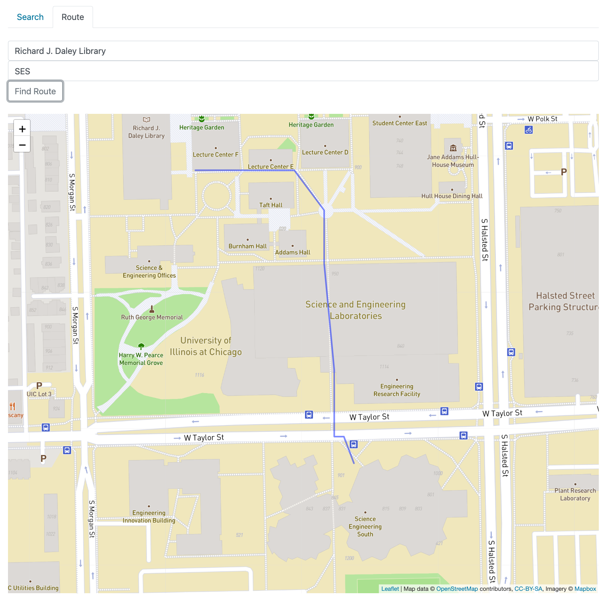

# OpenStreetMapProject
A C++ project that finds the shortest walking paths between UIC campus buildings using Dijkstra's algorithm and OpenStreetMap data. Includes both a terminal interface and a web-based visualization for interactive map-based pathfinding.

It includes:
- A terminal interface for input-based navigation
- A browser-based map visualization (served locally)
- Real-world building names and lat/long coordinates

## Features
- Efficient shortest path finding using Dijkstra
- Visual route displayed on UIC campus map
- Data structures and graph traversal in C++



## How to Run

### Terminal Interface
```bash
make osm_main
./osm_main


